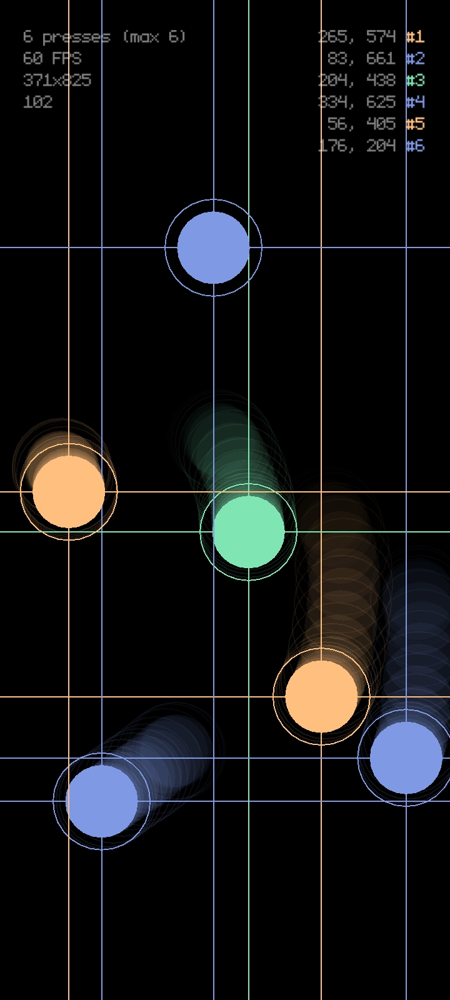

## love2d-touch-test

Simple app made in [LÖVE](https://love2d.org/) framework for touchscreen testing.

Originally made as a test for the [love.touch](https://love2d.org/wiki/love.touch) module.

## TODO

-~-

## License

Licensed under the [MIT License](./LICENSE.md).
